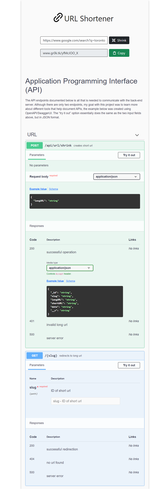

<!-- PROJECT LOGO -->
<br />
<p align="center">
  <a href="https://www.gr0k.tk/">
    
  </a>
</p>

Demo: https://www.gr0k.tk/

Simple tool that takes a long URL and makes it substantially shorter, ensuring that the target location is preserved after the conversion.

## Motivation

To learn more about Full-Stack web development, via the MERN stack. Furthermore, explore different tools that help document APIs, like OpenAPI/SwaggerUI.

## Features

- **URL Conversion**: convert a long URL into a short URL.
- **Interactive API**: view/try API endpoints listed on the documentation.

## Built With

This project was built using the MERN stack, which includes:

- [MongoDB](https://www.mongodb.com/)
- [Express.js](https://expressjs.com/)
- [React](https://reactjs.org/)
- [Nodejs](https://nodejs.org/en/)

**React** was used for Front-End Development, along with [Bootstrap](https://getbootstrap.com).\
**Express.js** and **PostgreSQL** were used to implement the RESTful API.\
[SwaggerUI](https://swagger.io/tools/swagger-ui/) was used for API documentation.

## Installation

```bash
# get the project
$ git clone https://github.com/shivamp08/url-shortener

# install dependencies
$ npm install

# run start (using react-scripts - default port: 5000)
$ npm start

```

## Screenshot


